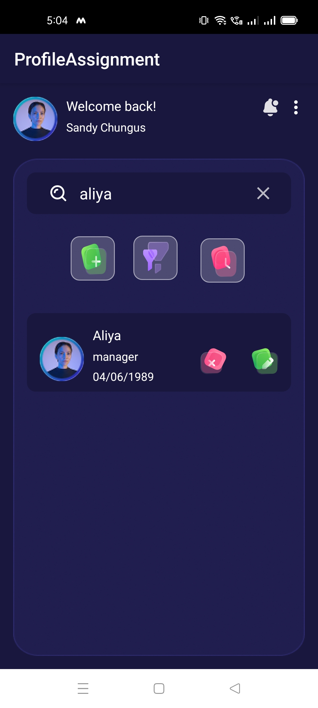
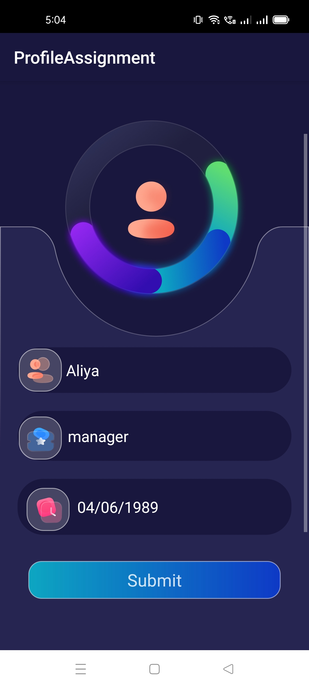
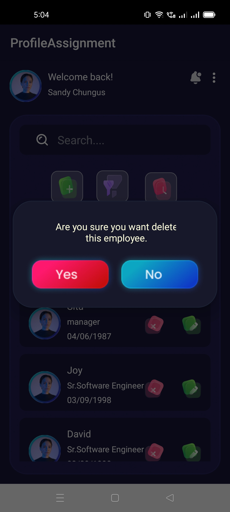
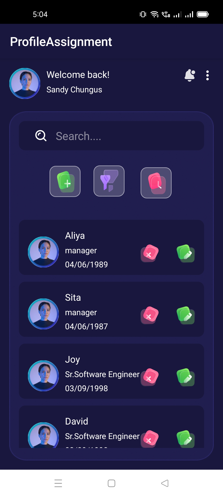

# Employee Management 

# Description

users can add, edit, delete employee record search employee by name and employee record store in Firebase Firestore 

## Key Features:

**Home Screen:**
  Display a list of employees using RecyclerView
**Add Employee:**
  Create a form with profile picture upload, name, designation, and DOB
**Edit Employee:**
  Allow updating existing employee details
**Delete Employee:**
  Provide a confirmation dialog before deleting an entry.
**DOB Selection:**
  Implement a date picker dialog for selecting the DOB.

## Screenshots

**Tech Stack:**

Language: Kotlin
Database: Firebase Firestore
UI: Jetpack Compose or XML
Implement Coroutines

